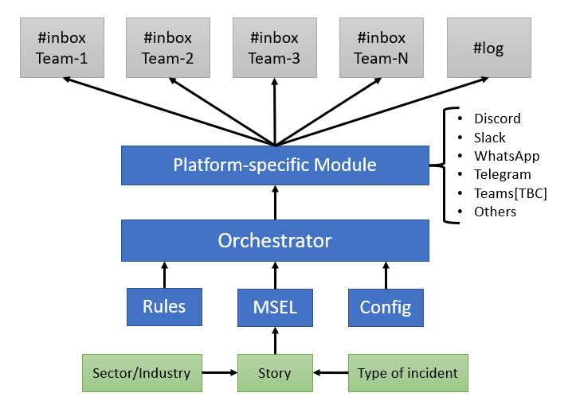

**********************************************************
T3SF - Technical Tabletop Exercises Simulation Framework
**********************************************************

.. contents:: Table of Contents

T3SF is a framework that offers a modular structure for the orchestration of events from a master scenario events list (MSEL) together with a set of rules defined for each exercise (optional) and a configuration that allows defining the parameters of the platform used. The main module performs the communication with the specific platform module (Discord, Slack, Telegram, etc.) which allows the events to be presented in the input channels as injects corresponding to each platform.

Schematic
==========

Supported platforms
====================

- :doc:`./Discord`
	- Start / Resume functions for incidents.
	- Incidents can have a picture attached and also the profile picture from the sender.
	- Automatic regular expression to match players and channels.
	- Core functionalities such as time difference, ping command and injects fetcher.

- :doc:`./Slack`
	- Start / Resume functions for incidents.
	- Incidents can have a picture attached and also the profile picture from the sender.
	- Automatic regular expression to match players and channels.
	- Core functionalities such as time difference, ping command and injects fetcher.

- :doc:`./Telegram`
	- Start / Resume functions for incidents.
	- Incidents are only capable to have an attached picture, no profile picture from the sender.
	- Manual Inbox fetcher with the command `!add`, due to the lack of options from Telegram.
	- Core functionalities such as time difference, ping command and injects fetcher.

- :doc:`./WhatsApp`
	- Start / Resume functions for incidents.
	- Incidents are only capable to have an attached picture, no profile picture from the sender.
	- Manual Inbox fetcher with the command `!add`, due to the lack of options from WhatsApp.
	- Core functionalities such as time difference, ping command and injects fetcher.

.. toctree::
	:caption: T3SF Core
	:maxdepth: 3
	:hidden:

	T3SF.Installation
	T3SF.Usage
	T3SF.CoreFunctions
	T3SF.Handlers
	T3SF.Gui
	T3SF.Logger

.. toctree::
	:caption: Supported Platforms
	:maxdepth: 3
	:hidden:

	Discord
	Slack
	Telegram
	WhatsApp

