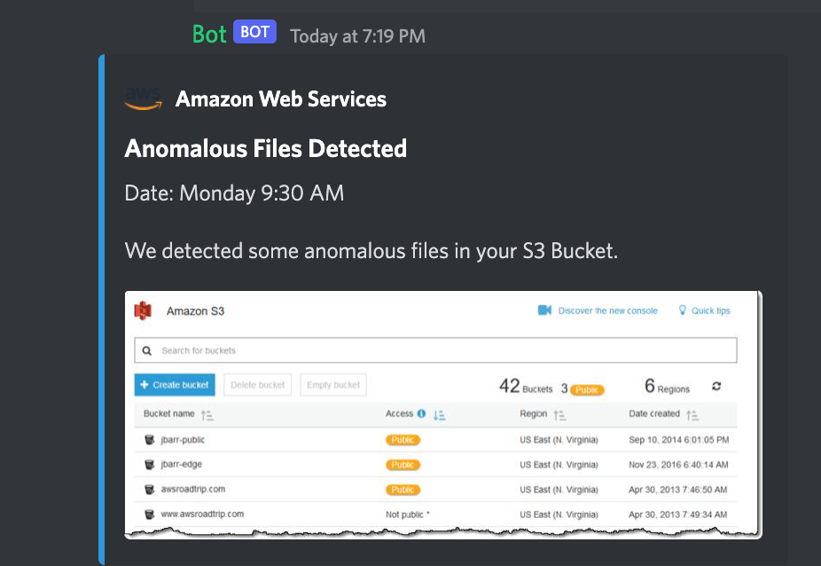
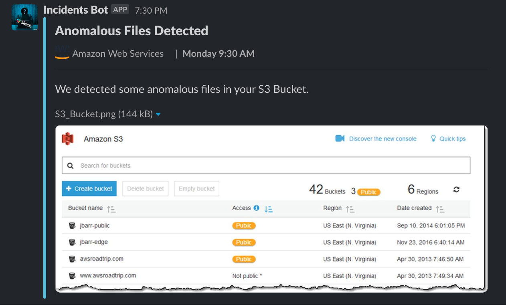
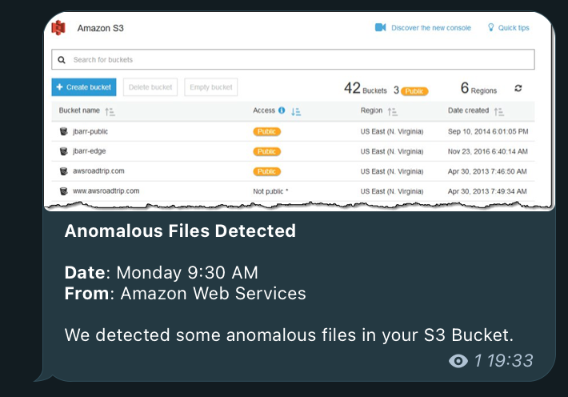
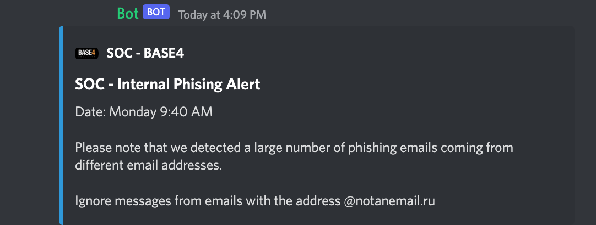
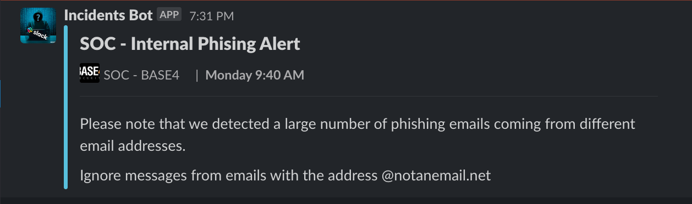
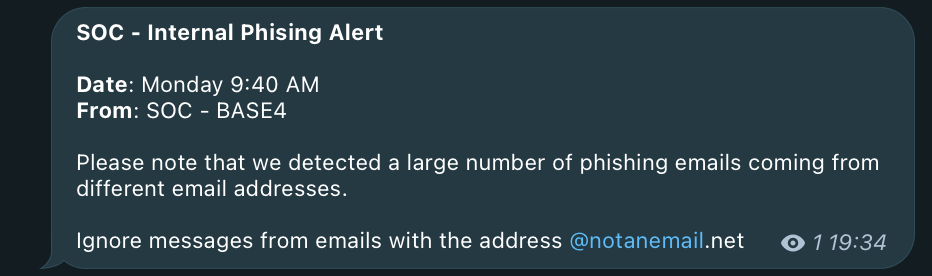
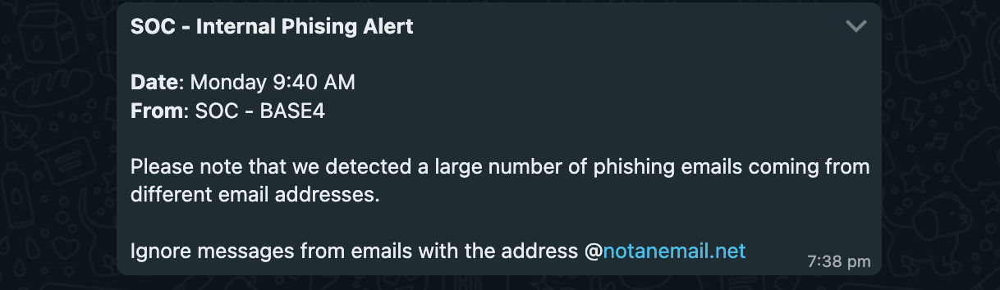

# Injects examples

Here is a list of the format of the injects inside each player's inbox sent by the bot.

We currently have 2 formats, with a Photo attached and without it (Only text).

Also, in Discord and Slack we have support to add a "Profile" picture from the sender.

## Inject with photo attached

### Discord

### Slack

### Telegram

### Whatsapp

## Simple Inject (only text)

### Discord

### Slack

### Telegram

### Whatsapp
