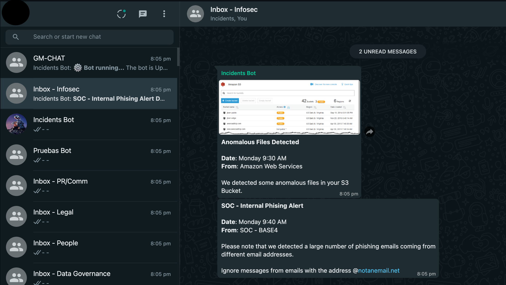

# WhatsApp Examples
This framework offers a range of features and capabilities when using it with WhatsApp, including:

- Comprehensive support for WhatsApp's API, allowing you to interact with channels, messages, users, and more.
- A modular architecture that enables you to easily extend and customize the platform's specified bot.
- A user-friendly interface that makes it easy to manage your bot and monitor its status.
- A special designed bot to interact directly with WhatsApp.

## Getting Started

To get started with the T3SF, you will only need to use as example, our `bot.py` file that starts the framework with the desired platform, in this case, WhatsApp. You can find detailed documentation on these topics on the documentation page.

The framework is easy to install and configure and comes with a range of pre-built modules and templates to help you get started.

## Example Screenshots
Here are some example screenshots of T3SF in action:

### Messages Arrive

This screenshot shows how messages are received and processed by T3SF. The framework provides comprehensive support for interacting with WhatsApp's messaging system, allowing you to send messages, images, polls, and detect actions based on specific message content or user behavior.